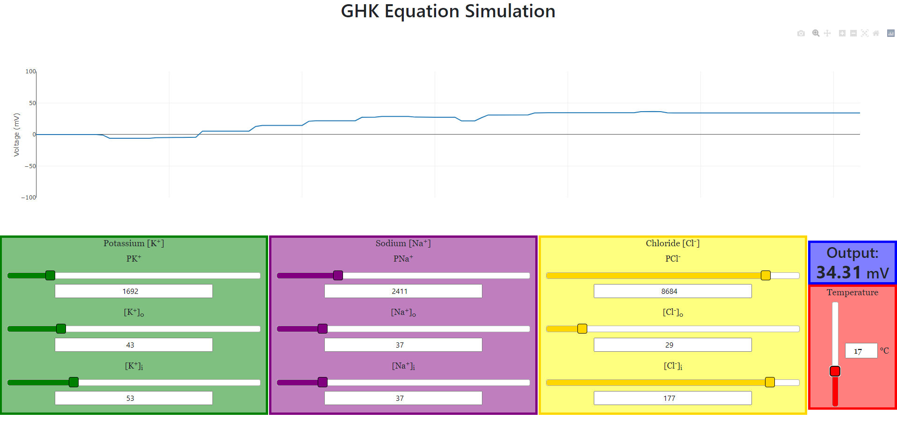

## GHK Simulator
BSU CS481 Capstone Project

## Members
- Taylor Brooks
- Jost Leavell
- Dawson Biersdorff

### Abstract
Our project is an easily accessible web application which provides a graphical interface for visual analysis of transmembrane voltage as calculated by the Goldman-Hodgkin Katz equation. The interface provides users with four input boxes for the ion concentrations and permeabilities for Potassium, Sodium, Chloride as well as the Temperature. Each of these boxes has a slider and a text box which allows the user to change the value of the variables. There is also one output box which displays the transmembrane voltage calculated by the Goldman-Hodgkin Katz equation utilizing the user inputted variables. 

The main feature of this application is the graph which gives the user a visual representation of the changes for each variable in real time. We have an auto scaling y-axis which displays the calculated voltage in mV. The x-axis is time and will display an interval of 2 minutes and 15 seconds.

Our goal for this project was to create an easy to use and easily accessible application for students, faculty or anyone else to have an interactive graphical experience working with the Goldman-Hodgkin Katz equation.

## Project Description
Our project is solely a front end web application with no back end involved. It utilizes basic html forms to receive the user input through text boxes and sliders. These values are then put into a javascript function that replicates the Goldman-Hodgkin Katz equation and calculates the voltage to be given to the user. A screenshot of the application is shown below.

### Application Overview

### How to Run
To run the application you can do one of the following:
- Navigate to https://cs481-ekh.github.io/s22-powerhouse/ to run it through the internet.
- Navigate to https://github.com/cs481-ekh/s22-powerhouse, click the big green Code button, and click Download ZIP. Then unzip the file and double click the index.html file in the folder. After the initial download this is to be able to run the program locally without an internet connection.

